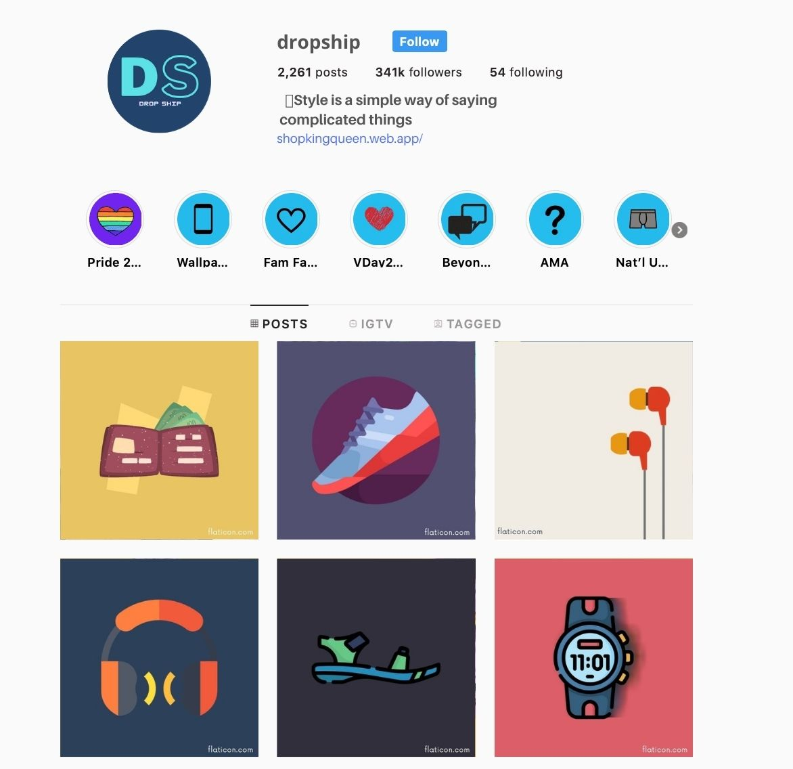

# Drop Ship 

An E-commerce application for drop-shippers!

  

[View Screenshots 🖼️](screenshots/)

## Overview?🌏
You might have come across a post, status, or stories on Facebook, Instagram, and Whatsapp about the sale of products and asking to dm if interested. 

  

A business model that is getting quite popular these days and a great cost-effective way to start a business, the drop shipping.
If you do not know, it's an inventory-less business model that does not require you to maintain any inventory, have a storage place, or even to arrange the shipping of your products to the customers directly. Instead of doing all that, you just need to collaborate directly with a drop-ship supplier.
 

To know more - https://printrove.com/blog/dropshipping-profitability-india/ 

 

The biggest challenge in this way is enlisting, categorization, and sharing the relevant details of the products with the customers.

Though Shopify websites can help, but for someone who is just getting into it, he/she might not want to bear this charge and, neither do need most of its features.

## How this helps?🤔
1. Helps in **enlisting** and **categorization** of the items.📚
2. A sleek and minimal **Website** and an **App** with almost no charges to represent the business.💰
3. Enables customers to directly reach to you through **Whatsapp**.😊

## License📄

[MIT](/LICENSE.md)